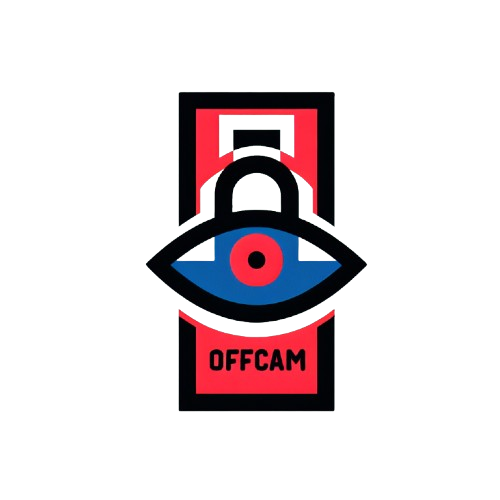
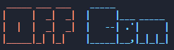
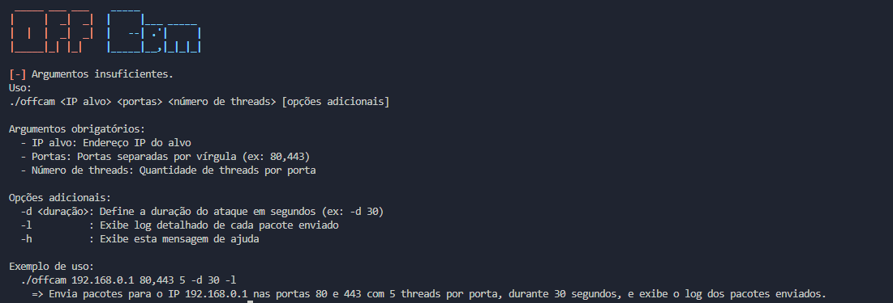

# OffCam 🚀

**OffCam** is a command-line tool designed for Linux to send random UDP packets to specified IP addresses and ports using multiple threads. Perfect for stress-testing your network or learning more about UDP traffic.

 <!-- Replace with actual banner image -->

## Features ✨

- **Multi-threaded**: Use multiple threads for sending packets.
- **Configurable Duration**: Set how long the attack should run.
- **Random Data**: Packets are filled with random data.
- **Optional Logging**: Enable detailed logs for each packet sent.
- **Simple to Use**: Easy command-line interface.

## Installation 🛠️

1. **Clone the Repository:**

    ```bash
    git clone https://github.com/lalaio1/OffCam
    ```

2. **Navigate to the Directory:**

    ```bash
    cd OffCam
    ```

3. **Run OffCam:**

    ```bash
    ./offcam -h
    ```

## Usage 📚



```bash
./offcam <IP alvo> <portas> <número de threads> [opções adicionais]
```


### Arguments

| Argument            | Description                                              |
|---------------------|----------------------------------------------------------|
| `<IP alvo>`         | Target IP address                                       |
| `<portas>`          | Ports separated by commas (e.g., 80,443)                |
| `<número de threads>` | Number of threads per port                             |
| `-d <duração>`      | Duration of the attack in seconds (e.g., `-d 30`)       |
| `-l`                | Enable detailed logging                                |
| `-h`                | Display help message                                    |

### Examples

- **Send packets to IP 192.168.0.1 on ports 80 and 443 with 5 threads per port for 30 seconds:**

    ```bash
    ./offcam 192.168.0.1 80,443 5 -d 30 -l
    ```

## Preview 📸

Here's a quick preview of the tool in action:




## Contributing 🤝

We welcome contributions! Feel free to open issues or submit pull requests.

## License 📜

This project is licensed under the MIT License. See the [LICENSE](LICENSE) file for details.

## Contact 📫

For any questions or support, please reach out to:

- **Username**: [lalaio1](https://github.com/lalaio1)
